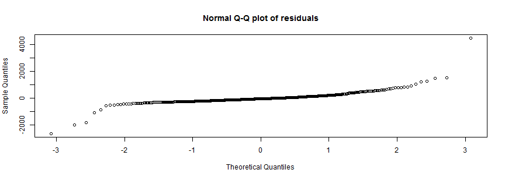

Book price prediction application
========================================================
author: Valeriy V. Atukhin
date: 13 July 2014
[Link to application](https://ikshot.shinyapps.io/book_price_predict/)

Idea: books and prices
========================================================

This is somehow made up, but useful app (for me at least).

I've got many books through the years and I've created a catalog of them 
which include authors, title, price, number of pages, etc, for each book.


```r
books <- read.csv("Books_data.csv",sep=";",
header=TRUE,as.is=c("Authors","Title"))
sapply(books[1,],class)
```

```
    Authors       Title       Price       Cover       Pages   Publisher 
"character" "character"   "integer"    "factor"   "integer"    "factor" 
```

Idea: books and prices (part 2)
========================================================

Let's imagine that I want to buy a book on some topic. I have general sense about what kind 
of book it should be, and using the accumulated info I want to predict how much such a 
book will cost me. For example:
- foreign books are higher in price due to packaging and transportation costs and currency conversion;
- quick references on topics have less pages and lower price then books with deep coverage of those topics;
- hardcovered books generally costs higher then paperbacks and so on.

Application back-end
========================================================

Based on my books dataset with **480** observations the app builds linear regression model 
with **Price** as dependent variable and **Publisher (Russian or Foreign), 
Type of cover** and **Number of pages** as predictors.

```r
model=lm(Price~Pages*Cover+Pages*Publisher+  Cover*Publisher,data=books)
```


Some notes
========================================================

- Because I am in Russia, I've got initial costs (in my dataset) in rubles **(RUR)** - 
our currency. Those are converted to **USD** if necessary.
- Lower bound for price is set to **0**, because price cannot be negative.
- Have fun! :)
